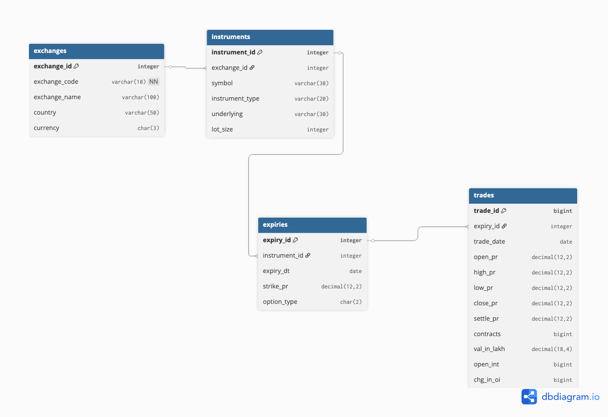

# NSE F&O Database

Built a relational database for NSE Futures & Options data as part of a data analyst assignment. The idea was to take a flat ~150k row CSV and turn it into a proper normalized schema that could actually scale.

Dataset: [NSE Future and Options Dataset 3M — Kaggle](https://www.kaggle.com/datasets/sunnysai12345/nse-future-and-options-dataset-3m)

---

## what this does

Takes the raw NSE F&O CSV and loads it into a 4-table relational database. Then runs 7 analytical queries on it - OI analysis, rolling volatility, option chain, futures basis, max pain etc.

Used DuckDB because it runs without a server and works great in a notebook. The schema is designed to also support BSE and MCX data , just need to ingest those CSVs.

---

## schema

4 tables in 3NF:

```
exchanges → instruments → expiries → trades
```

**exchanges** — just NSE, BSE, MCX. 3 rows.

**instruments** — unique symbols per exchange. NIFTY, BANKNIFTY, RELIANCE etc. A few hundred rows.

**expiries** — each unique contract. One symbol + one expiry date + one strike + CE or PE. This is the main normalization win — instead of repeating "NIFTY 11500 CE Oct2019" in every single trade row, we store it once here and use an ID.

**trades** — the actual daily price data. OHLC, volume, open interest. 149k rows in this dataset.



---

## why not one flat table

Could have kept everything in one CSV-style table. But NIFTY alone appears in 50k+ rows — storing the full symbol name and instrument type every single time wastes space and makes updates painful. If a lot size changes, you'd have to update thousands of rows instead of one.

Also wanted the schema to support multiple exchanges without restructuring. Right now it's all NSE data but BSE and MCX rows are already in the exchanges table — just need the data.

---

## files

```
nse-options-db/
├── nse_fo_analysis.ipynb   — main notebook, run this
├── er_diagram.png          — database schema diagram  
├── reasoning.pdf           — design decisions explained
└── README.md
```

---

## how to run

**Google Colab (easiest):**
1. Open `nse_fo_analysis.ipynb` in Colab
2. Upload the Kaggle CSV, rename it `fo_data.csv`
3. Runtime → Run all

**Local:**
```bash
pip install duckdb pandas matplotlib jupyter
jupyter notebook nse_fo_analysis.ipynb
```

---

## queries

1. top 10 symbols by OI change — where is big money moving
2. 7 day rolling volatility for NIFTY options
3. index futures vs stock futures settle price comparison
4. NIFTY option chain — calls vs puts by strike with PCR
5. max volume days in last 30 days + EXPLAIN query plan
6. BANKNIFTY top 5 OI strikes per expiry (max pain)
7. NIFTY near month futures settle price over time

---

## stack

Python, DuckDB, pandas, matplotlib — runs fully in a notebook, no server needed.
